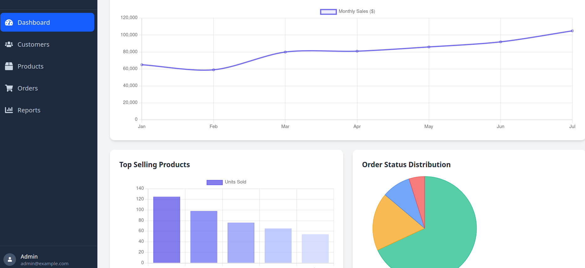
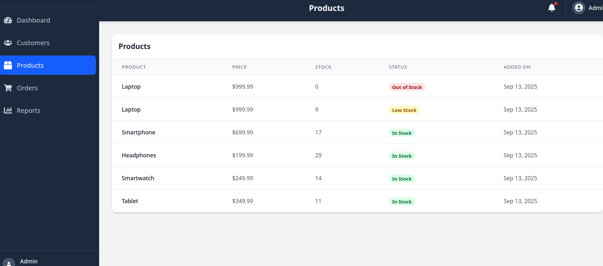
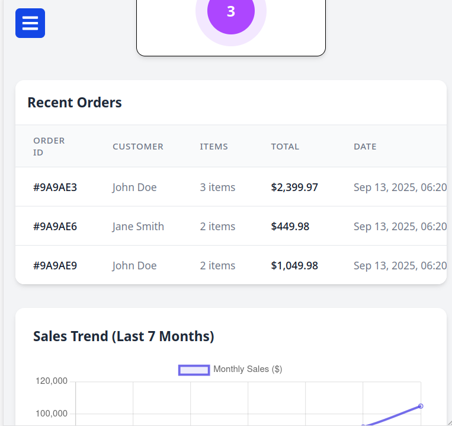

# Dashboard Frontend

A modern, responsive admin dashboard built with React and Tailwind CSS, designed to provide a clean and intuitive interface for managing e-commerce data.

## 📸 Screenshots

### Dashboard Overview


The main dashboard provides a comprehensive overview of your e-commerce metrics, featuring key performance indicators, recent orders, and quick access to important functions. The clean, modern interface is designed for at-a-glance monitoring of your business performance.

### Interactive Charts


Visualize your sales and customer data with our interactive charts. Track trends, compare metrics, and gain valuable insights into your business performance through intuitive data visualizations.

### Product Grid View


Browse your product catalog in a clean, organized grid layout. The responsive design ensures products are displayed optimally across all device sizes, with easy filtering and search functionality.

### Mobile Responsive Design


Our fully responsive design ensures seamless access to all dashboard features on mobile devices. The interface automatically adapts to different screen sizes, providing an optimal viewing experience on any device.

## 🚀 Features

- **Dashboard Overview**: At-a-glance metrics and visualizations
- **Customer Management**: View and manage customer information
- **Product Catalog**: Browse and manage product inventory
- **Order Tracking**: Monitor and manage customer orders
- **Responsive Design**: Works on desktop and tablet devices
- **Fallback Data**: Uses local dummy data when API is unavailable

## 🛠️ Tech Stack

- **Frontend Framework**: React
- **Styling**: Tailwind CSS
- **Data Visualization**: Chart.js with react-chartjs-2
- **HTTP Client**: Axios
- **Routing**: React Router DOM
- **Icons**: React Icons
- **Build Tool**: Vite

## 📊 API Endpoints

The application attempts to connect to a backend API at `http://localhost:4000` with the following endpoints:

- `GET /api/customers` - Fetch customer data
- `GET /api/products` - Fetch product catalog
- `GET /api/orders` - Fetch order history
- `GET /api/recent-activity` - Fetch recent system activities

### Fallback Mechanism

If the API is not available (e.g., backend server is down), the application automatically falls back to using the local `DummyData.json` file. This ensures the application remains functional for demonstration purposes.

## 🚀 Getting Started

### Prerequisites

- Node.js (v16 or higher)
- npm or yarn

### Installation

1. Clone the repository:

   ```bash
   git clone [your-repository-url]
   cd dashboard-frontend
   ```

2. Install dependencies:
   ```bash
   npm install
   # or
   yarn
   ```

### Running the Application

1. Start the development server:

   ```bash
   npm run dev
   # or
   yarn dev
   ```

2. Open [http://localhost:5173](http://localhost:5173) in your browser.

### Building for Production

```bash
npm run build
# or
yarn build
```

## 📁 Project Structure

```
src/
├── assets/           # Static assets
├── components/       # Reusable components
│   ├── Dashboard/    # Dashboard-specific components
│   └── SideBar/      # Sidebar navigation components
├── App.jsx           # Main application component
└── main.jsx          # Application entry point
```

## 🛠 Development

- Lint code:

  ```bash
  npm run lint
  # or
  yarn lint
  ```

- Preview production build:
  ```bash
  npm run preview
  # or
  yarn preview
  ```

## 📄 License

This project is licensed under the MIT License

## 🔗 Related Projects

- [Backend Repository](https://github.com/muratcan-yuksel/dashboard-project-backend) - The backend server for this dashboard, built with Node.js and Express.
